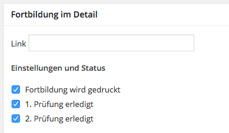
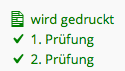

# training-session Plugin for Wordpress
This Plugin adds a custom Post Type training_session. It may also capture CF7 (Contact Form 7) submits for the Post Type.

## Fortbildungen Exportieren und in inDesign setzen

### Prüfungen vor dem Export

Überprüfe im Wordpress (WP) Backend welche Fortbildungen gedruckt werden sollen und welche nicht es werden nur solche Fortbildungen exportiert bei denen die folgenden Einstellungen gewählt wurden:  

 bzw. in der Listenansicht: 

Überprüfe ob die Kategorien der Fortbildungen richtig sind. Es also keine Doppelungen gibt wie z.B. "MINT" und "MINT (Mathematik, Informatik, Natur und Technik)"

### Export
Füge auf einer beligiben Seite den folgenden Export-Shortcode ein am besten auf https://www.zfl.fau.de/wissenstransfer/fortbildungen/ am ende der Seite temporär einfügen. Dabei an die individuellen Vorstellungen anpassen.

	[fbpxml small="Chemie" dateformat="d.m.Y" timeformat="H:i" check="1" startdate="01.03.2016" monthsinfuture=20] 

Attribut | Wertbeispiel | Default | Details
:-- |:-- |:-- |:--
small|Chemie|none|Kategorien welche nur als liste gedruckt werden
dateformat|d.m.Y|WP|Datenformat der Ausgabe
timeformat|H:i|WP|Zeitformat der Ausgabe
startdate|01.03.2016|today|Format wie Wordpress Einstellung, Tag ab dem welchem Fortbildungen Exportiert werden (1. Datum)
monthsinfuture|2|8|ca. Monate nach dem Startdatum für welche Exportiert wird (Default: 8), ohne Funktion wenn enddate ist gesetz
enddate|31.12.2016|none|Format wie Wordpress Einstellung, Tag ab bis zu welchem Fortbildungen Exportiert werden (1. Datum)
check|1|1| mit 0 kann man erzwingen das auch nicht geprüfte Forbildungen exportiert werden.
